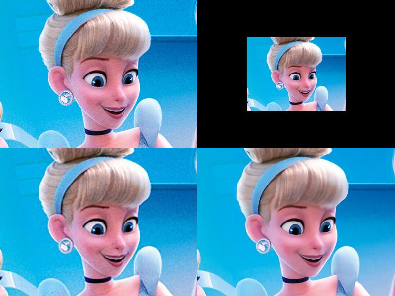
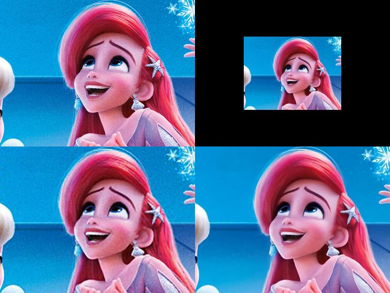
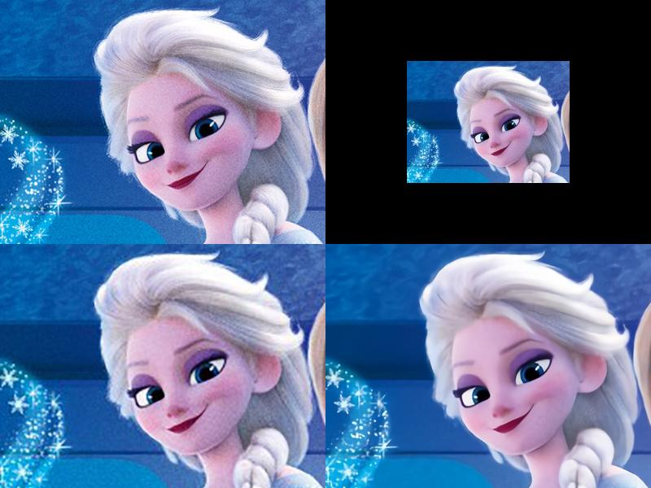
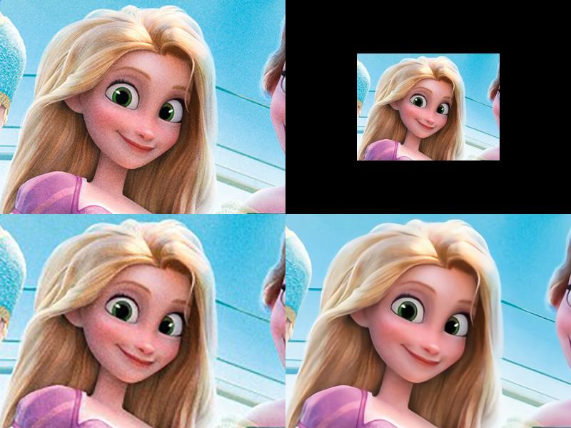
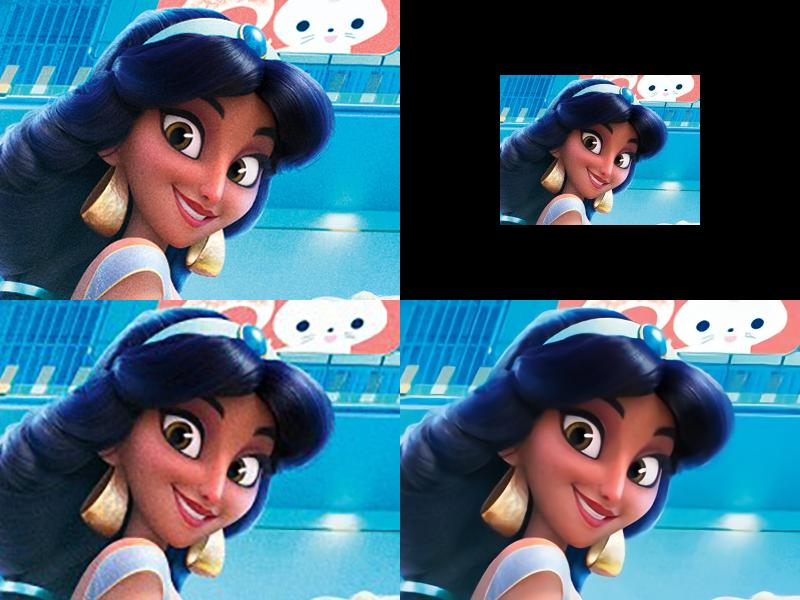
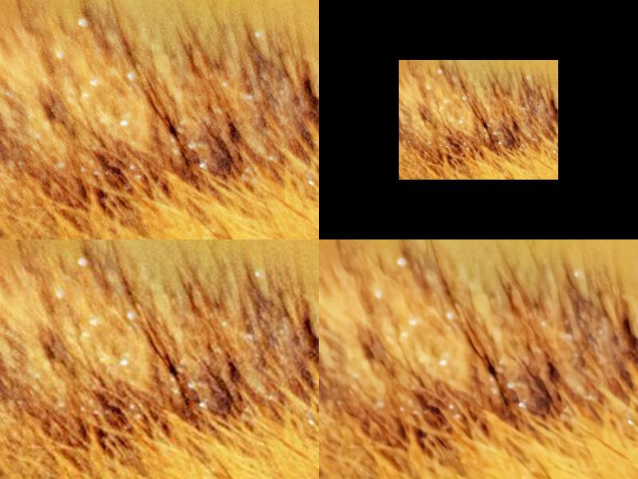
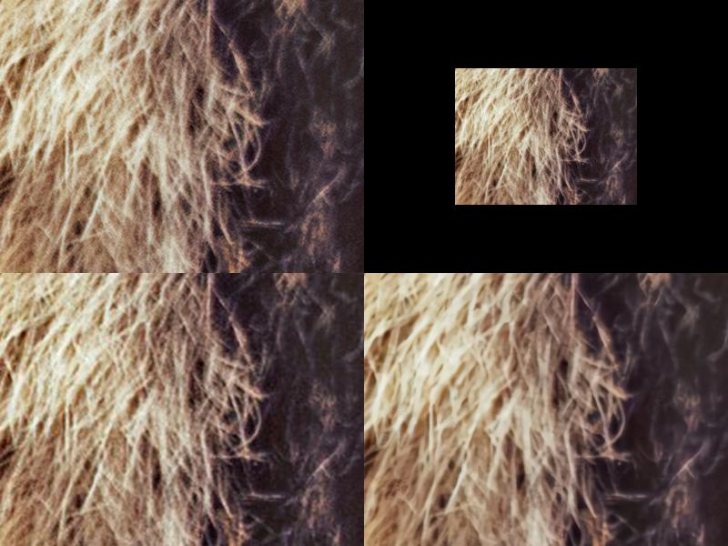
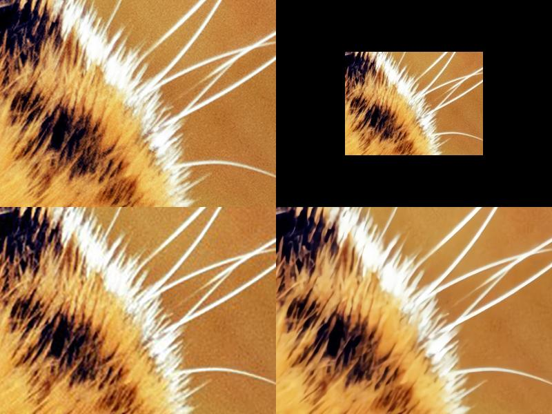
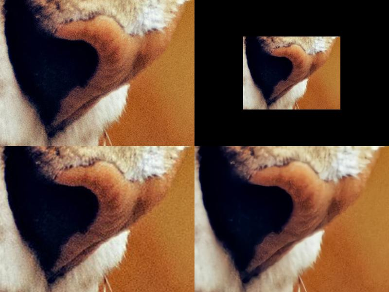
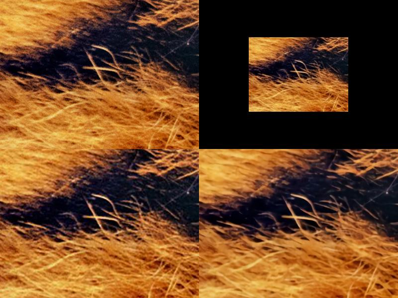

## Welcome to 'Image/Video Scale-Up Solution' Pages

repository
[Link](https://github.com/ryuseun/solution_scaleup)

*Animation Image Comparison #0  
_LeftUp: Croped Original Image_ <-------------> _RightUp: Half Size Image (Used as input)_   
_LeftDown: Scale-Up by using Photoshop_ <--> _RightDown: Scale-Up by using Proposed Method_   

Animation Image Comparison #1  
_LeftUp: Croped Original Image_ <-------------> _RightUp: Half Size Image (Used as input)_   
_LeftDown: Scale-Up by using Photoshop_ <--> _RightDown: Scale-Up by using Proposed Method_   

Animation Image Comparison #2  
_LeftUp: Croped Original Image_ <-------------> _RightUp: Half Size Image (Used as input)_   
_LeftDown: Scale-Up by using Photoshop_ <--> _RightDown: Scale-Up by using Proposed Method_  

Animation Image Comparison #3  
_LeftUp: Croped Original Image_ <-------------> _RightUp: Half Size Image (Used as input)_   
_LeftDown: Scale-Up by using Photoshop_ <--> _RightDown: Scale-Up by using Proposed Method_  

*Animation Image Comparison #4  
_LeftUp: Croped Original Image_ <-------------> _RightUp: Half Size Image (Used as input)_   
_LeftDown: Scale-Up by using Photoshop_ <--> _RightDown: Scale-Up by using Proposed Method_  

*Natural Image Comparison #0  
_LeftUp: Croped Original Image_ <-------------> _RightUp: Half Size Image (Used as input)_   
_LeftDown: Scale-Up by using Photoshop_ <--> _RightDown: Scale-Up by using Proposed Method_  

*Natural Image Comparison #1  
_LeftUp: Croped Original Image_ <-------------> _RightUp: Half Size Image (Used as input)_   
_LeftDown: Scale-Up by using Photoshop_ <--> _RightDown: Scale-Up by using Proposed Method_  

*Natural Image Comparison #2  
_LeftUp: Croped Original Image_ <-------------> _RightUp: Half Size Image (Used as input)_   
_LeftDown: Scale-Up by using Photoshop_ <--> _RightDown: Scale-Up by using Proposed Method_  

*Natural Image Comparison #3  
_LeftUp: Croped Original Image_ <-------------> _RightUp: Half Size Image (Used as input)_   
_LeftDown: Scale-Up by using Photoshop_ <--> _RightDown: Scale-Up by using Proposed Method_  

*Natural Image Comparison #4  
_LeftUp: Croped Original Image_ <-------------> _RightUp: Half Size Image (Used as input)_   
_LeftDown: Scale-Up by using Photoshop_ <--> _RightDown: Scale-Up by using Proposed Method_  

### Contact
ryuseun@gmail.com
